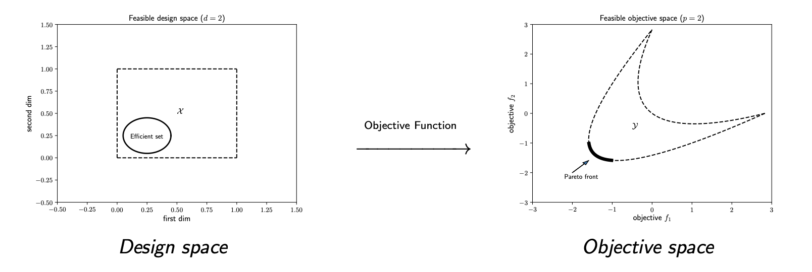
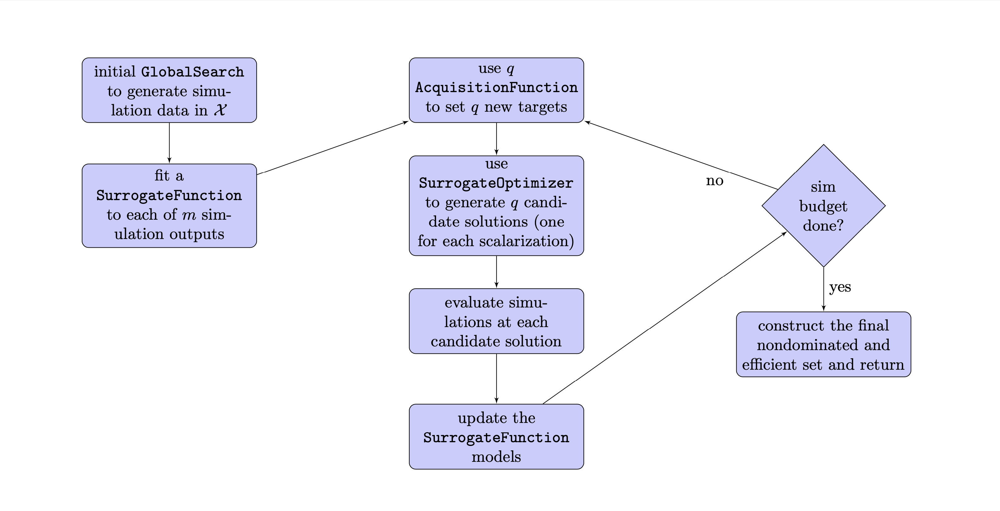

Learn about MOOPs
=================

Overview
--------

A *multiobjective optimization problem* (MOOP) is an optimization problem
involving multiple, potentially conflicting, objectives.
MOOPs arise in many areas of science and engineering, for example, when
designing a product or fitting a model according to multiple performance
criteria.

The goal of a MOOP is to find numerous solutions that describe the
tradeoffs between these (potentially conflicting) *objectives*.
The solution to a MOOP is a set of achievable objective scores
(and corresponding design points), describing the inherent tradeoffs
in the problem.
This tradeoff curve is called the *Pareto front*.
Real-world MOOPs may also involve some *constraints*---additional
hard rules that every solution must adhere to.

|

In a multiobjective *simulation-based* optimization problem, the objectives
are derived from the outputs of one or more potentially computationally expensive 
simulations.
ParMOO is designed to solve multiobjective simulation-based
optimization problems by exploiting the simulation-based structure in
such problems.

.. figure:: img/des-sim-obj-space.png
    :alt: Designs, simulations, and objectives
    :align: center
    :scale: 40

|

One of the key concepts in ParMOO is the distinction between simulations
and objectives.

In ParMOO, a *simulation* is a computationally expensive function:
it may require significant computational resources and may have
a nonnegligible execution time.
A single MOOP may involve multiple simulations, with varying costs, which map from the design variables to an intermediate space

.. math::
    {\bf S} : {\cal X} \rightarrow {\cal S},
    \qquad
    {\cal X} \subset \mathbb{R}^n,
    {\cal S} \subset \mathbb{R}^m.

ParMOO provides a framework for solving these problems, while
parallelizing simulation evaluations.

In ParMOO, both objectives and constraints are algebraic functions of the
design variables and/or the simulation outputs.
After evaluating the simulation(s), evaluating the objective is assumed to
be computationally inexpensive and tends to present a smaller
opportunity for parallelization.

Objectives are expressed as

.. math::
    {\bf F} :{\cal X} \times {\cal S} \rightarrow {\cal Y},
    \qquad
    {\cal Y} \subset \mathbb{R}^o.

Constraints are expressed as

.. math::
    {\bf G} :{\cal X} \times {\cal S} \rightarrow \mathbb{R}^p.

ParMOO allows one to separately specify simulations, objective functions,
and constraint functions. ParMOO will then utilize simulations sparingly,
but it may use many objective and constraint evaluations to solve problems of
the form 

.. math::
    \min_{{\bf x} \in {\cal X}} {\bf F}({\bf x}, {\bf S}({\bf x}))
    \quad {s.t.} \quad
    {\bf G}({\bf x}, {\bf S}({\bf x})) \leq {\bf 0}^* .

:math:`^*` Here ":math:`\min`" is understood in the Pareto sense.

ParMOO Algorithm
----------------

ParMOO uses response surface methodology to solve MOOPs.
This means that ParMOO fits a computationally cheaper surrogate
to each output simulation, then optimizes various scalarizations
of your problem using these surrogates instead of running the
expensive simulations.

.. only:: html

    .. figure:: img/parmoo_movie.gif
        :alt: ParMOO animation
        :align: center
        :scale: 40

    |

The key difference between ParMOO and other response surface techniques
is that ParMOO uses its surrogates to model the *simulation* response surfaces,
not to directly model the *objective* values.
This allows ParMOO to exploit additional information about your problem,
in situations where it is available.

Common use cases include the following.
 * One or more objectives does not depend on any simulation outputs
   and therefore can be evaluated directly without concern for computational
   expense.
 * The MOOP involves multiple simulations, each with differing costs, and
   therefore one simulation can be evaluated far more times than the other.
 * The objectives have some exploitable structure, for example, the
   sum-of-squared simulation outputs, which readily admits additional
   information about the shape of the objective response surfaces.

This process has several key components, which ParMOO allows
users to interchange.
 * Before fitting any surrogates or performing any scalarizations, ParMOO
   must search the design space using one of the ``GlobalSearch``
   implementations from the ``parmoo.searches`` module.
 * After some data has been generated, ParMOO fits and updates a surrogate
   for each simulation output using one of the ``SurrogateFunction``
   implementations from the ``parmoo.surrogates`` module.
 * After fitting surrogates, ParMOO must scalarize the objectives so that
   it can solve the surrogate problems and produce candidate design points
   using one of the ``AcquisitionFunction`` implementations from the
   ``parmoo.acquisitions`` module.
 * ParMOO must solve the scalarized surrogate optimization problems
   using one of the ``SurrogateOptimizer`` implementations from the
   ``parmoo.optimizers`` module.

|

You may mix and match built-in techniques to generate your own unique MOOP
solver, or you may implement your own techniques by employing one of
the abstract base classes defined in ``parmoo.structs``.

Glossary
--------

 * **Design variable:**
   A *design variable* is an input to your simulations, which can be controlled
   within some reasonable bounds.
    * **Ex.-** when designing an air foil using a fluid dynamics simulation,
      one design variable might be the angle of attack.
    * ParMOO currently supports continuous and categorical design variables.
 * **Design space:**
   The *design space* is the space of all possible design variable
   combinations.
    * **Ex.-** if you have :math:`n` continuous design variables, then
      your design space might be all of :math:`\mathbb{R}^n`.
 * **Constraint:**
   A *constraint* is a requirement that every solution point must satisfy.
    * **Ex.-** if your simulation code fails whenever :math:`x_1 > x_2`,
      then you might impose the constraint: :math:`x_2 - x_1 \leq 0`.
 * **Hard constraint:**
   A *hard constraint* cannot be violated by the MOOP solver.
   ParMOO will never attempt to evaluate a point that violates a hard
   constraint.
    * **Ex.-** your simulation code does not need to be defined for points
      that are outside the upper/lower bounds on the design variables.
 * **Soft constraint:**
   A *soft constraint* must be satisfied for a point to be considered a
   solution, but ParMOO may violate it during the course of the optimization
   process.
    * **Ex.-** all nonlinear constraints are soft constraints for ParMOO,
      and ParMOO will evaluate design points that violate these constraints,
      especially early in the optimization process.
 * **Bound constraint:**
   A *bound constraint* is a simple upper/lower bound on the range of
   design values.
   In ParMOO, these are treated as hard constraints, while all other
   constraints are considered to be soft.
 * **Feasible design space:**
   The *feasible design space* is the subset of the design
   space where all constraints are satisfied.
   In other words, this is the set of all "legal" designs.
 * **Simulation:**
   A *simulation* is a computationally expensive process that is required
   to compute your objectives, constraints, or both.
    * **Ex.-** if you are designing a material, your simulation may be 
      a molecular dynamics code.
    * Each simulation may have a single output or many outputs, which will
      be passed on as inputs to your objectives and/or constraints.
 * **Objective:**
   An *objective* is one of possibly many criteria that you will use to rank
   the "goodness" of a particular design configuration.
   By convention, we assume that your goal is to minimize all objectives.
    * **Ex.-** if you are designing materials, you may want to minimize
      the production of unwanted byproducts.
    * If your goal is actually to maximize an objective
      :math:`f_{max}`, you may supply the negated value of that
      objective :math:`-f_{max}` to ParMOO.
 * **Feasible objective space:**
   The *feasible objective space* is the space of all objective scores
   that can be obtained, by evaluating every objective at a configuration
   from the feasible design space.
    * In practice, you will not know your feasible objective space *a priori*.
 * **Nondominated:**
   A point :math:`{\bf y}^*` in a set
   :math:`{\cal V} \subset \mathbb{R}^p`
   is *nondominated* if for all :math:`{\bf y} \in {\cal V}`, either
   :math:`{\bf y} = {\bf y}^*` or :math:`{\bf y}^*` is less than
   :math:`{\bf y}` in at least one of its :math:`p` components.
    * Objective values that are feasible and nondominated in the set of
      all observations make up the solution set returned by ParMOO.
 * **Pareto optimal:**
   A point in the feasible objective space is *Pareto optimal* for a given
   MOOP if it is nondominated in the feasible objective space.
    * This is a member of the true solution set for a MOOP.
    * In practice, we cannot typically guarantee that any point in a
      multiobjective simulation optimization problem is Pareto optimal,
      so we return solutions that are nondominated among all other objective
      values that we have observed.
 * **Pareto front:**
   The *Pareto front* is the set of all Pareto optimal objective points.
    * This is the true solution to a multiobjective optimization problem.
 * **Efficient set:**
   The *efficient set* is the set of all corresponding design
   configurations that produce points on the Pareto front.
    * These are the solutions in the feasible design space that the 
      objectives map onto the Pareto front.
 * **Surrogate:**
   A *surrogate* is a computational model that approximates another
   underlying function.
    * **Ex.-** a trained artificial neural network, Gaussian process,
      RBF model, or spline interpolant.
 * **Scalarization:**
   A *scalarization* technique reduces a MOOP into a single-objective
   optimization problem.
   Typically, solving the scalarized problem should produce a solution that
   is efficient/Pareto optimal.
    * **Ex.-** minimize the weighted sum of all objectives in a MOOP
      to obtain a single efficient point/Pareto optimal value.
 * **Design of experiments/experimental design:**
   An *experimental design* is a set of design points that are in some sense
   space filling and could
   be evaluated to gain some initial data for a particular simulation.
    * **Ex.-** generate 100 uniform random samples within the feasible design
      space.
