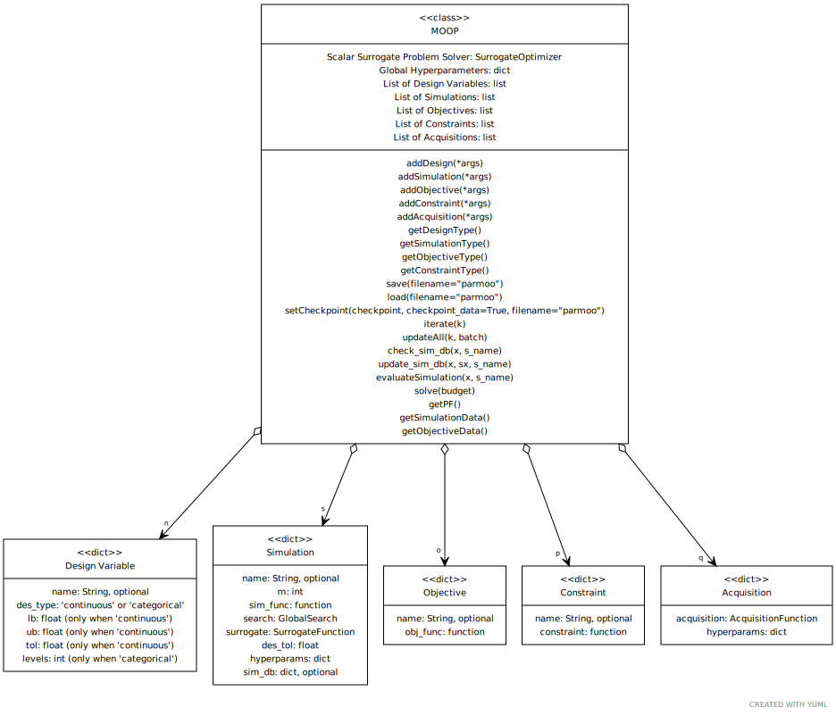

Write a ParMOO Script
=====================

The MOOP class
--------------

The :mod:`MOOP <moop.MOOP>` class is the fundamental data structure in
ParMOO.
Below is a UML diagram showing the key public methods and
dependencies.

|

To create an instance of the :mod:`MOOP <moop.MOOP>` class,
use the :meth:`constructor <moop.MOOP.__init__>`.

.. code-block:: python

    from parmoo import MOOP
    moop = MOOP(optimizer, hyperparams=hp)

In the above code snippet, ``optimizer`` should be an implementation
of the :mod:`SurrogateOptimizer <structs.SurrogateOptimizer>` ABC,
and the optional input ``hp`` is a dictionary of hyperparameters for the
``optimizer`` object.
The ``optimizer`` is the surrogate optimization method that will be used
when solving your MOOP.
The choice of surrogate optimizer determines what information
will be required when defining each objective and constraint.
 * If you use a derivative-free technique, such as
   :meth:`LocalGPS <optimizers.gps_search.LocalGPS>`,
   then you do not need to provide derivative information for your
   objective or constraint functions.
 * If you use a derivative-based technique, such as
   :meth:`LBFGSB <optimizers.lbfgsb.LBFGSB>`,
   then you need to provide an additional input
   to your objectives and constraint functions, which can be
   set to evaluate their derivatives with respect to design inputs
   and simulation outputs.

To avoid issues, it is best to define your MOOP in the following order.

 1. Add design variables using
    :meth:`MOOP.addDesign(*args) <moop.MOOP.addDesign>`.
 2. Add simulations using
    :meth:`MOOP.addSimulation(*args) <moop.MOOP.addSimulation>`.
 3. Add objectives using
    :meth:`MOOP.addObjective(*args) <moop.MOOP.addObjective>`.
 4. Add constraints using
    :meth:`MOOP.addConstraint(*args) <moop.MOOP.addConstraint>`.
 5. Add acquisitions using
    :meth:`MOOP.addAcquisition(*args) <moop.MOOP.addAcquisition>`.

All of these methods accept one or more ``args``, each of which is a
dictionary, as detailed in the corresponding sections below.

.. _naming:

The name Key and ParMOO Output Types
------------------------------------

Each of the design, simulation, objective, and constraint dictionaries
may contain an optional ``name`` key.
By default, the ``name`` of the simulations, objectives, and constraints
default to ``{sim|f|c}i``,
where ``sim`` is for a simulation, ``f`` is for an objective,
``c`` is for a constraint, and ``i=1,2,...``
is determined by the order in which each was added.
For example, if you add 3 simulations, then they will automatically
be named ``sim1``, ``sim2``, and ``sim3`` unless a different name,
was specified for one or more by including the ``name`` key.
Similarly, objectives are named ``f1``, ``f2``, ..., and
constraints are named ``c1``, ``c2``, ....

The design variables are the only exception to this rule.

Working with Named Outputs
~~~~~~~~~~~~~~~~~~~~~~~~~~

When every design variable is given a name,
then ParMOO formats its output in a numpy structured array, using the
given/default names to specify each field.
This operation mode is recommended, especially for first-time users.

.. literalinclude:: ../examples/named_var_ex.py
    :language: python

The result is the following.

.. literalinclude:: ../examples/named_var_ex.out

Working with Unnamed Outputs
~~~~~~~~~~~~~~~~~~~~~~~~~~~~

If even a single design variable is left with a blank ``name`` key,
then all outputs are placed in a Python
dictionary, with the following keys:
 * ``x_vals: (np.ndarray)`` of length :math:`N \times n` --
   number of data points by number of design variables;
 * ``s_vals: (np.ndarray)`` of length :math:`N \times m` --
   number of data points by number of outputs for a particular simulation;
 * ``f_vals: (np.ndarray)`` of length :math:`N \times o` --
   number of data points by number of objectives;
 * ``c_vals: (np.ndarray)`` of length :math:`N \times c` --
   number of data points by number of constraints, if any.

Note that the value of :math:`N` (number of data points0 may vary by
database).
Each column in each of ``x_vals``, ``s_vals``, ``f_vals``, and ``c_vals``
will correspond to a specific design variable, simulation output,
objective function, or constraint, determined by the order in
which they were added to the MOOP.
For first-time users, this execution mode may be confusing;
however, for advanced users, the convenience of using numpy.ndarrays
over structured arrays may be preferable.

.. literalinclude:: ../examples/unnamed_var_ex.py
    :language: python

The result is below.
Note that in this example, there are :math:`N=20` points in both the
objective and simulation databases.

.. literalinclude:: ../examples/unnamed_var_ex.out

Adding Design Variables
-----------------------

Design variables are added to your :mod:`MOOP <moop.MOOP>` object
using the :meth:`addDesign(*args) <moop.MOOP.addDesign>` method.
ParMOO currently supports
two types of design variables:
 * ``continuous`` and
 * ``categorical``.

To add a continuous variable, use the following format.

.. code-block:: python

    # Add a continuous design variable
    moop.addDesign({'name': "MyContVar", # optional
                    'des_type': "continuous",
                    'lb': 0.0,
                    'ub': 1.0,
                    'des_tol': 1.0e-8})

|

 * Note that when the ``des_type`` key is omitted, its value defaults to
   ``continuous.``
 * For continuous design variables, both a lower (``lb``) and upper (``ub``)
   bound must be specified.
   These bounds are *hard constraints*, meaning that no simulations
   or objectives will be evaluated outside of these bounds.
 * The optional key ``des_tol`` specifies a minimum step size between
   values for this design variable (default value is :math:`10^{-8}`).
   For this design variable, any two values that are closer than ``des_tol``
   will be treated as exactly equal.

To add a categorical design variable, use the following format.

.. code-block:: python

    # Add a categorical design variable
    moop.addDesign({'name': "MyCatVar", # optional
                    'des_type': "categorical",
                    'levels': 3})

|

 * The ``levels`` key is is an integer specifying the
   number of categories taken on by this design variable.
   ParMOO will index these levels by :math:`0, 1, \ldots, \text{levels}-1`.

Note that for every MOOP, at least one design variable is required
before solving.

Adding Simulations
------------------

Before you can add a simulation to your :mod:`MOOP <moop.MOOP>`, you must
define the simulation function.
The expected signature of your simulation function depends on whether you
are working with :ref:`named or unnamed outputs <naming>`.
%GW: Shouldn't the "or" not be in italics?

When working with named variables, the simulation should take a single
numpy structured array as input, whose keys match the design variable
names.
The simulation function returns a numpy.ndarray containing the simulation
output(s).

For example, with three design variables named ``x1``, ``x2``, and
``x3``, you might define the quadratic
:math:`{\bf S}({\bf x}) = \|{\bf x}\|^2` as follows.

.. code-block:: python

    def quadratic_sim(x):
        return np.array([x["x1"] ** 2 + x["x2"] ** 2 + x["x3"] ** 2])

If you are working with unnamed variables, then the simulation will
accept a numpy.ndarray of length ``n``, where the indices correspond
to the order in which the design variables were added to the MOOP.
The example above would change as follows.

.. code-block:: python

    def quadratic_sim(x):
        return np.array([x[0] ** 2 + x[1] ** 2 + x[2] ** 2])

To add your simulation to the :mod:`MOOP <moop.MOOP>` object,
use the :meth:`addSimulation(*args) <moop.MOOP.addSimulation>` method.

.. code-block:: python

    from parmoo.searches import LatinHypercube
    from parmoo.surrogates import GaussRBF

    moop.addSimulation({'name': "MySim", # optional
                        'm': 1, # number of outputs
                        'sim_func': quadratic_sim, # simulation function
                        'search': LatinHypercube, # search technique
                        'surrogate': GaussRBF, # surrogate model
                        'hyperparams': {'search_budget': 20}})

%GW: Why is this in bold in  the  pdf?
In the above example,
 * ``name`` is used as described in :ref:`named or unnamed outputs <naming>`;
 * ``m`` specifies the number of outputs for this simulation;
 * ``sim_func`` is given a reference to the simulation function;
 * ``search`` specifies the :mod:`GlobalSearch <structs.GlobalSearch>`
   that you will use when generating data for this particular simulation;
 * ``surrogate`` specifies the class of
   :mod:`SurrogateFunction <structs.SurrogateFunction>`
   that you will use to model this particular simulation's output;
 * ``hyperparams`` is a dictionary of hyperparameter values that will be
   passed to the surrogate and search technique objects.
   One particularly important key in the ``hyperparams`` dictionary is the
   ``search_budget`` key, which specifies how many simulation evaluations
   should be used during the initial search phase.

If you wish, you may create a MOOP without any simulations.

Using a Precomputed Simulation Database
~~~~~~~~~~~~~~~~~~~~~~~~~~~~~~~~~~~~~~~

%GW: Why bold  first  sentence?
The simulation dictionary may actually contain one additional key:
 * The ``sim_db`` key specifies a database of precomputed simulation
   outputs, which will be used when fitting the surrogate models.

%GW: Again, why  is  "or" in  italics  (presumably  for   ref?)
Currently, this particular input does not support both of ParMOO's
execution modes (:ref:`named or unnamed outputs <naming>`), so
we do not encourage its usage and may remove it in the future.
Instead, if you would like to specify a precomputed database, you could
use the
:meth:`MOOP.update_sim_db(x, sx, s_name) <moop.MOOP.update_sim_db>`
method to add all simulation data into ParMOO's database after creating
your MOOP but before solving.
Be careful not to add duplicate points, because these could cause numerical
issues when fitting surrogate models.

.. literalinclude:: ../examples/precomputed_data.py
    :language: python

The output of the above code is shown below.

.. literalinclude:: ../examples/precomputed_data.out

Adding Objectives
-----------------

Objectives are algebraic functions of your design variables and
simulation outputs.
ParMOO always minimizes objectives.
To define an objective, make sure you match the expected signature,
which depends on whether you are using
:ref:`named or unnamed outputs <naming>`.
%GW: or italics?

For named outputs, your objective function should accept two
numpy structured arrays and return a single scalar output.
The following objective minimizes the output of the simulation output
named ``MySim.``

.. code-block:: python

def min_sim(x, sim):
        return sim["MySim"]

Similarly, the following objective minimizes the squared value of the
design variable named ``MyDes``.

.. code-block:: python

    def min_des(x, sim):
        return x["MyDes"] ** 2

If you are using a gradient-based
:mod:`SurrogateOptimizer <structs.SurrogateOptimizer>`,
then you are required to supply an additional input named ``der``, 
which defaults to 0.
The ``der`` input is used as follows:
 * ``der=0`` (default) implies that no derivatives are taken, and
   you will return the objective function value;
 * ``der=1`` implies that you will return an array of derivatives with
   respect to each design variable; and
 * ``der=2`` implies that you will return an array of derivative with
   respect to each simulation output.

Note that for categorical variables ParMOO does not use the partial
derivatives given here, and it is acceptable to fill these slots
with a garbage value or leave them uninitialized.

Modifying the above two objectives to support derivative-based solvers,
we get the following.

.. code-block:: python

    def min_sim(x, sim, der=0):
        if der == 0:
            # No derivative, just return the value of sim["MySim"]
            return sim["MySim"]
        elif der == 1:
            # Derivative wrt each design variable is 0
            return np.zeros(1, x.dtype)[0]
        elif der == 2:
            # Derivative wrt other simulations is 0, but df/d"MySim"=1
            result = np.zeros(1, sim.dtype)[0]
            result["MySim"] = 1.0
            return  result

    def min_des(x, sim, der=0):
        if der == 0:
            # No derivative, just return the value of x["MyDes"] ** 2
            return x["MyDes"] ** 2
        elif der == 1:
            # Derivative wrt other design vars is 0, but df/d"MyDes"=2"MyDes"
            result = np.zeros(1, x.dtype)[0]
            result["MyDes"] = 2.0 * x["MyDes"]
            return result
        elif der == 2:
            # Derivative wrt each simulations is 0
            return np.zeros(1, sim.dtype)[0]

For a full example showing how to solve a MOOP using a derivative-based
solver, see :ref:`Solving a MOOP with Derivative-Based Solvers <advanced_ex>`
in :doc:`Basic Tutorials <tutorials/basic-tutorials>`.

When using ParMOO with unnamed outputs, each objective should accept
two 1D numpy.ndarrays instead.
The above example would be modified as follows, assuming that ``MySim``
was the first simulation and ``MyDes`` was the
first design variable added to the MOOP.

.. code-block:: python

    def min_sim(x, sim, der=0):
        if der == 0:
            # No derivative, just return the value of sim[0]
            return sim[0]
        elif der == 1:
            # Derivative wrt each design variable is 0
            return np.zeros(x.size)
        elif der == 2:
            # Derivative wrt other simulations is 0, but df/dsim[0]=1
            return np.eye(sim.size)[0]

    def min_des(x, sim, der=0):
        if der == 0:
            # No derivative, just return the value of x["MyDes"] ** 2
            return x[0] ** 2
        elif der == 1:
            # Derivative wrt other design vars is 0, but df/d"MyDes"=2"MyDes"
            result = np.zeros(x.size)
            result[0] = 2.0 * x[0]
            return result
        elif der == 2:
            # Derivative wrt each simulations is 0
            return np.zeros(sim.size)

To add the objective(s), use the
:mod:`MOOP.addObjective(*args) <moop.MOOP.addObjective>` method.

.. code-block:: python

    moop.addObjective({'name': "Min MySim",
                       'obj_func': min_sim})

    moop.addObjective({'name': "Min MyDes",
                       'obj_func': min_des})

Note that for every MOOP, at least one objective is required before solving.

Adding Constraints
------------------

Adding constraints is similar to adding objectives.
The main difference is in how ParMOO treats constraint functions.
Although ParMOO may evaluate infeasible design points along the way,
ParMOO will search for solutions where all constraints are less than
or equal to zero.

For example, to add the constraint that the simulation ``MySim`` must
have output greater than or equal to 0 and that the design variable
``MyDes`` must be less than or equal to 0.9, you would define the
following constraint functions.

.. code-block:: python

    def sim_constraint(x, sim):
        return -1.0 * sim["MySim"]

    def des_constraint(x, sim):
        return x["MyDes"] - 0.9

As with objectives, if you want to use a gradient-based
:mod:`SurrogateOptimizer <structs.SurrogateOptimizer,>` you must
modify the above constraint functions as follows.

.. code-block:: python

    def sim_constraint(x, sim, der=0):
        if der == 0:
            return -1.0 * sim["MySim"]
        elif der == 1:
            return np.zeros(1, x.dtype)[0]
        elif der == 2:
            result = np.zeros(1, sim.dtype)[0]
            result["MySim"] = -1.0
            return result

    def des_constraint(x, sim, der=0):
        if der == 0:
            return x["MyDes"] - 0.9
        elif der == 1:
            result =  np.zeros(1, x.dtype)[0]
            result["MyDes"] = 1.0
            return result
        elif der == 2:
            return np.zeros(1, sim.dtype)[0]

If you are operating with unnamed variables, use indices similarly
as with the objectives.

.. code-block:: python

    def sim_constraint(x, sim, der=0):
        if der == 0:
            return -1.0 * sim[0]
        elif der == 1:
            return np.zeros(x.size)
        elif der == 2:
            return -np.eye(sim.size)[0]

    def des_constraint(x, sim, der=0):
        if der == 0:
            return x[0] - 0.9
        elif der == 1:
            return np.eye(x.size)[0]
        elif der == 2:
            return np.zeros(sim.size)

To add the constraint(s), use the
:mod:`MOOP.addConstraint(*args) <moop.MOOP.addConstraint>` method.

.. code-block:: python

    moop.addConstraint({'name': "Constrain MySim",
                        'constraint': sim_constraint})

    moop.addConstraint({'name': "Constrain MyDes",
                        'constraint': des_constraint})

You are not required to add any constraints of this form to your MOOP
before solving.

Adding Acquisitions
-------------------

After you have added all of the design variables, simulations, objectives,
and constraints to your MOOP, you must add one or more acquisitions
using the :meth:`MOOP.addAcquisition(*args) <moop.MOOP.addAcquisition>`
method.

.. code-block:: python

    from parmoo.acquisitions import UniformWeights, FixedWeights

    moop.addAcquisition({'acquisition': UniformWeights})
    moop.addAcquisition({'acquisition': FixedWeights,
                         'hyperparams': {'weights': np.array([0.5, 0.5])}})

%GW: why bold?
The acquisition dictionary may contain two keys:
 * ``acquisition`` (required) specifies one
   :mod:`AcquisitionFunction <structs.AcquisitionFunction>`
   that you would like to use for this problem; and
 * ``hyperparams`` (optional) specifies a dictionary of hyperparameter
   values that are used by the specified
   :mod:`AcquisitionFunction <structs.AcquisitionFunction>`.

The number of acquisitions added determines the batch size for each of
ParMOO's batches of simulation evaluations (which could be done in parallel).
**In general, if there are q acquisition functions and s simulations,
the ParMOO will generate batches of q*s simulations**.
In other words, each simulation is evaluated once per acquisition function in each
iteration of ParMOO's algorithm.

Methods for Solving
-------------------

Once you have finished creating your :mod:`MOOP <moop.MOOP>` object and
adding all design variables, simulations, objectives, constraints,
and acquisitions, you are ready to solve your problem.

The easiest way to solve is by using :meth:`MOOP.solve(k) <moop.MOOP.solve>`.
Here, ``k`` is the number of iterations of ParMOO's algorithm
that you would like to perform.
Note that a value of ``k=0`` is legal, and will result in ParMOO
generating and evaluating an experimental design and fitting its surrogates,
without ever attempting to solve a single scalarized surrogate problems.

.. code-block:: python

    # Evaluate an experimental design, then performing 5 iterations
    moop.solve(5)

Note that the above command will perform all simulation evaluations serially.
To generate a batch of simulations that you could evaluate in parallel,
use :meth:`MOOP.iterate(k) <moop.MOOP.iterate,>` where ``k`` is the iteration
index.
You can let ParMOO handle the simulation evaluations with
:meth:`MOOP.evaluateSimulation(x, s_name) <moop.MOOP.evaluateSimulation>,`
or you can evaluate the simulations yourself and add them to the simulation
database using
:meth:`MOOP.update_sim_db(x, sx, s_name) <moop.MOOP.update_sim_db>.`
Afterward, call `MOOP.updateAll(k, batch) <moop.MOOP.updateAll>` to
update the surrogate models and objective database.

.. code-block:: python

    # Do 5 iterations letting ParMOO handle simulation evaluation
    # Note that the i=0 iteration will just generate an experimental design
    for i in range(5):
        # Get batch
        batch = moop.iterate(i)
        # Let ParMOO evaluate design point x for simulation s_name
        for (x, s_name) in batch:
            moop.evaluateSimulation(x, s_name)
        # Update ParMOO models
        moop.updateAll(i, batch)

or

.. code-block:: python

    # Solve another MOOP, doing simulation evaluation manually
    for i in range(5):
        # Get batch
        batch = moop.iterate(i)
        # User evaluates design point x for simulation s_name
        for (x, s_name) in batch:
            ### User code to evaluate x with sim["s_name"] goes HERE ###
            ### Store results in variable sx ###
            moop.update_sim_db(x, sx, s_name)
        # Update ParMOO models
        moop.updateAll(i, batch)

Additional ParMOO solver execution paradigms (including those where ParMOO
will handle parallel execution on the user's behalf) are included under
:doc:`Additional ParMOO Plugins and Features <extras>.`.

Viewing Your Results
--------------------

After solving the MOOP, you can view the results using
:meth:`MOOP.getPF() <moop.MOOP.getPF>`.

.. code-block:: python

    soln = moop.getPF()

To get the full simulation and objective databases, you can also use
:meth:`MOOP.getSimulationData() <moop.MOOP.getSimulationData>`
and
:meth:`MOOP.getObjectiveData() <moop.MOOP.getObjectiveData>`.

.. code-block:: python

    sim_db = moop.getSimulationData()
    obj_db = moop.getObjectiveData()

To understand the format of these outputs, please revisit the section on
:ref:`The name Key and ParMOO Output Types <naming>`.

Built-in and Custom Components
------------------------------

By now you can see that the performance of ParMOO is determined
by your choices of
 * :mod:`AcquisitionFunction <structs.AcquisitionFunction>`,
 * :mod:`GlobalSearch <structs.GlobalSearch>`,
 * :mod:`SurrogateFunction <structs.SurrogateFunction>`, and
 * :mod:`SurrogateOptimizer <structs.SurrogateOptimizer>`.

%GW: Why bold?
You can find the current options for each of these in the following modules.
 * :doc:`parmoo.acquisitions <modules/acquisitions>`
 * :doc:`parmoo.searches <modules/searches>`
 * :doc:`parmoo.surrogates <modules/surrogates>`
 * :doc:`parmoo.optimizers <modules/optimizers>`

You can also create your own custom implementations for each of the above,
by implementing one of the abstract base classes in :mod:`structs`.

