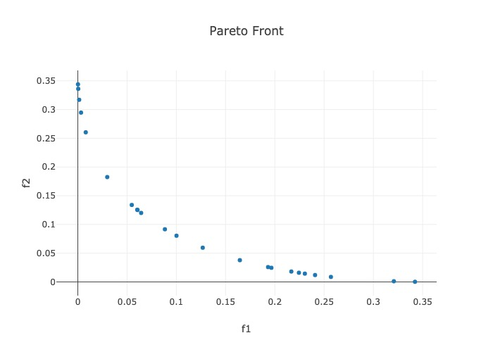

.. _Quickstart:

Quickstart
==========

ParMOO is a parallel multiobjective optimization solver that seeks to
exploit simulation-based structure in objective and constraint functions.

To exploit structure, ParMOO models *simulations* separately from
*objectives* and *constraints*. In our language:

 * a **design variable** is an input to the problem, which we can directly
   control;
 * a **simulation** is an expensive or time-consuming process, including
   real-world experimentation, which is treated as a blackbox function
   of the design variables and evaluated sparingly;
 * an **objective** is an algebraic function of the design variables
   and/or simulation outputs, which we would like to optimize; and
 * a **constraint** is an algebraic function of the design variables
   and/or simulation outputs, which cannot exceed a specified bound.

.. figure:: img/des-sim-obj-space.png
    :alt: Designs, simulations, and objectives
    :align: center

|

To solve a multiobjective optimization problem (MOOP), we use surrogate
models of the simulation outputs, together with the algebraic definition of
the objectives and constraints.

.. only:: html

    .. figure:: img/parmoo_movie.gif
        :alt: ParMOO animation
        :align: center

    |

In order to achieve scalable parallelism, we use libEnsemble_ to distribute
batches of simulation evaluations across parallel resources.

Dependencies
------------

ParMOO has been tested on Unix/Linux and MacOS systems.

ParMOO's base has the following dependencies:

 * Python_ 3.8+
 * numpy_ -- for data structures and performant numerical linear algebra
 * scipy_ -- for scientific calculations needed for specific modules
 * pyDOE_ -- for generating experimental designs
 * pandas_ -- for exporting the resulting databases

Additional dependencies are needed to use the additional features in
``parmoo.extras``:

 * libEnsemble_ -- for managing parallel simulation evaluations

And for using the Pareto front visualization library in ``parmoo.viz``:

 * plotly_ -- for generating interactive plots
 * dash_ -- for hosting interactive plots in your browser
 * kaleido_ -- for exporting static plots post-interaction

Installation
------------

The easiest way to install ParMOO is via the Python package index, PyPI
(commonly called ``pip``):

.. code-block:: bash

    pip install < --user > parmoo

where the braces around ``< --user >`` indicate that the ``--user`` flag is
optional.

To install *all* dependencies (including libEnsemble) use:

.. code-block:: bash

    pip install < --user > "parmoo[extras]"

You can also clone this project from our GitHub_ and ``pip`` install it
in-place, so that you can easily pull the latest version or checkout
the ``develop`` branch for pre-release features.
On Debian-based systems with a bash shell, this looks like:

.. code-block:: bash

   git clone https://github.com/parmoo/parmoo
   cd parmoo
   pip install -e .

Alternatively, the latest release of ParMOO (including all required and
optional dependencies) can be installed from the ``conda-forge`` channel using:

.. code-block:: bash

   conda install --channel=conda-forge parmoo

Before doing so, it is recommended to create a new conda environment using:

.. code-block:: bash

   conda create --name channel-name
   conda activate channel-name

For detailed instructions, see :doc:`install`.

Testing
-------

If you have pytest_ with the pytest-cov_ plugin and flake8_ installed,
then you can test your installation.

.. code-block:: bash

   python3 setup.py test

These tests are run regularly using GitHub Actions_.

Basic Usage
-----------

ParMOO uses numpy_ in an object-oriented design, based around the
:mod:`MOOP <moop.MOOP>` class.
To get started, create a :mod:`MOOP <moop.MOOP>` object, using the
:meth:`constructor <moop.MOOP.__init__>`.

.. code-block:: python

   from parmoo import MOOP
   from parmoo.optimizers import LocalGPS

   my_moop = MOOP(LocalGPS)

To summarize the framework, in each iteration ParMOO models each simulation
using a computationally cheap surrogate, then solves one or more scalarizations
of the objectives, which are specified by acquisition functions.
Read more about this framework at our :doc:`Learn About MOOPs <about>` page.
In the above example,
:mod:`optimizers.LocalGPS <optimizers.gps_search.LocalGPS>`
is the class of optimizers
that the ``my_moop`` will use to solve the scalarized surrogate problems.

Next, add design variables to the problem as follows using the
:meth:`MOOP.addDesign(*args) <moop.MOOP.addDesign>` method.
In this example, we define one continuous and one categorical design variable.
Other options include integer, custom, and raw (using raw variables is not
recommended except for expert users).

.. code-block:: python

   # Add a single continuous design variable in the range [0.0, 1.0]
   my_moop.addDesign({'name': "x1", # optional, name
                      'des_type': "continuous", # optional, type of variable
                      'lb': 0.0, # required, lower bound
                      'ub': 1.0, # required, upper bound
                      'tol': 1.0e-8 # optional tolerance
                     })
   # Add a second categorical design variable with 3 levels
   my_moop.addDesign({'name': "x2", # optional, name
                      'des_type': "categorical", # required, type of variable
                      'levels': ["good", "bad"] # required, category names
                     })

Next, add simulations to the problem as follows using the
:meth:`MOOP.addSimulation(*args) <moop.MOOP.addSimulation>` method.
In this example, we define a toy simulation ``sim_func(x)``.

.. code-block:: python

   import numpy as np
   from parmoo.searches import LatinHypercube
   from parmoo.surrogates import GaussRBF

   # Define a toy simulation for the problem, whose outputs are quadratic
   def sim_func(x):
      if x["x2"] == "good":
         return np.array([(x["x1"] - 0.2) ** 2, (x["x1"] - 0.8) ** 2])
      else:
         return np.array([99.9, 99.9])
   # Add the simulation to the problem
   my_moop.addSimulation({'name': "MySim", # Optional name for this simulation
                          'm': 2, # This simulation has 2 outputs
                          'sim_func': sim_func, # Our sample sim from above
                          'search': LatinHypercube, # Use a LH search
                          'surrogate': GaussRBF, # Use a Gaussian RBF surrogate
                          'hyperparams': {}, # Hyperparams passed to internals
                          'sim_db': { # Optional dict of precomputed points
                                     'search_budget': 10 # Set search budget
                                    },
                         })

Now we can add objectives and constraints using
:meth:`MOOP.addObjective(*args) <moop.MOOP.addObjective>` and
:meth:`MOOP.addConstraint(*args) <moop.MOOP.addConstraint>`.
In this example, there are 2 objectives (each corresponding to a single
simulation output) and one constraint.

.. code-block:: python

   # First objective just returns the first simulation output
   def f1(x, s): return s["MySim"][0]
   my_moop.addObjective({'name': "f1", 'obj_func': f1})
   # Second objective just returns the second simulation output
   def f2(x, s): return s["MySim"][1]
   my_moop.addObjective({'name': "f2", 'obj_func': f2})
   # Add a single constraint, that x[0] >= 0.1
   def c1(x, s): return 0.1 - x["x1"]
   my_moop.addConstraint({'name': "c1", 'constraint': c1})

Finally, we must add one or more acquisition functions using
:meth:`MOOP.addAcquisition(*args) <moop.MOOP.addAcquisition>`.
These are used to scalarize the surrogate problems.
The number of acquisition functions
typically determines the number of simulation evaluations per batch.
This is useful to know if you are using a parallel solver.

.. code-block:: python

   from parmoo.acquisitions import RandomConstraint

   # Add 3 acquisition functions
   for i in range(3):
      my_moop.addAcquisition({'acquisition': RandomConstraint,
                              'hyperparams': {}})

Finally, the MOOP is solved using the
:meth:`MOOP.solve(budget) <moop.MOOP.solve>` method, and the
results can be viewed using
:meth:`MOOP.getPF() <moop.MOOP.getPF>`.

.. code-block:: python

   my_moop.solve(5) # Solve with 5 iterations of ParMOO algorithm
   results = my_moop.getPF() # Extract the results

After executing the above block of code, the ``results`` variable points to
a numpy structured array, each of whose entries corresponds to a
nondominated objective value in the ``my_moop`` object's final database.
You can reference individual fields in the ``results`` array by using the
``name`` keys that were assigned during ``my_moop``'s construction, or
plot the results by using the :doc:`viz <modules/viz>` library.

Congratulations, you now know enough to get started solving MOOPs!

Minimal Working Example
-----------------------

Putting it all together, we get the following minimal working example.

.. literalinclude:: ../examples/quickstart.py
    :language: python

The above code saves all (approximate) Pareto optimal solutions in the
``results`` variable, and prints the ``results`` variable to the standard
output:

.. literalinclude:: ../examples/quickstart.out

And produces the following figure of the Pareto points:

|

Next Steps
----------

 * If you want to take advantage of all that ParMOO has to offer, 
   please see :doc:`Writing a ParMOO Script <how-to-write>`.
 * If you would like more information on multiobjective optimization
   terminology and ParMOO's methodology, see the
   :doc:`Learn About MOOPs <about>` page.
 * For a full list of basic usage tutorials, see
   :doc:`More Tutorials <tutorials/basic-tutorials>`.
 * To start solving MOOPs on parallel hardware, install libEnsemble_ and
   see the :doc:`libEnsemble tutorial <tutorials/libe-tutorial>`.
 * See some of our pre-built solvers in the parmoo_solver_farm_.
 * To interactively explore your solutions, install its extra dependencies and
   use our built-in :doc:`viz <modules/viz>` tool.

Resources
---------

To seek support or report issues, e-mail:

 * ``parmoo@mcs.anl.gov``

Our full documentation is hosted on:

 * ReadTheDocs_

Please read our LICENSE_ and CONTRIBUTING_ files.

.. _Actions: https://github.com/parmoo/parmoo/actions
.. _CONTRIBUTING: https://github.com/parmoo/parmoo/blob/main/CONTRIBUTING.rst
.. _dash: https://dash.plotly.com
.. _flake8: https://flake8.pycqa.org/en/latest
.. _GitHub: https://github.com/parmoo/parmoo
.. _kaleido: https://github.com/plotly/Kaleido
.. _libEnsemble: https://github.com/Libensemble/libensemble
.. _LICENSE: https://github.com/parmoo/parmoo/blob/main/LICENSE
.. _numpy: https://numpy.org
.. _pandas: https://pandas.pydata.org
.. _parmoo_solver_farm: https://github.com/parmoo/parmoo-solver-farm
.. _plotly: https://plotly.com/python
.. _pyDOE: https://pythonhosted.org/pyDOE
.. _pytest: https://docs.pytest.org/en/7.0.x
.. _pytest-cov: https://pytest-cov.readthedocs.io/en/latest
.. _Python: https://www.python.org/downloads
.. _ReadTheDocs: https://parmoo.readthedocs.org
.. _scipy: https://scipy.org
