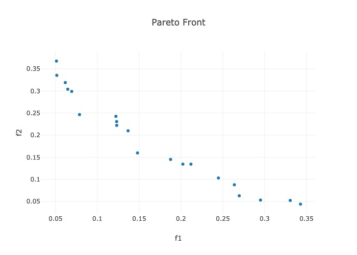

Solving High-Dimensional Multiobjective Optimization Problems
=============================================================

.. _high_d_ex:

Solving high-dimensional blackbox optimization problems is very hard.
Solving them in the multiobjective sense is even harder.
Doing this efficiently on a limited budget could be considered a
*grand challenge* type problem.

To quote our FAQ_:

 - The key issue is that **global optimization is expensive**.
   At a fundamental level, *no blackbox solver* can guarantee global
   convergence without
   densely sampling the design space, which is exponentially expensive
   when ``n`` (number of design variables) is large.
   So what can you do?
   You can switch to using **local modeling methods**, whose costs
   generally only grow linearly in the dimension.
   You will not get any global convergence guarantees, but in many
   cases, you will still be able to *approximately* solve your problem.
 - If you have a lot of design variables, then you might do better
   with a local solver, by switching your surrogate to the
   :class:`LocalGaussRBF <surrogates.gaussian_proc.LocalGaussRBF>`
   surrogate.
   If you are using the
   :class:`LBFGSB <optimizers.lbfgsb.LBFGSB>` optimizer, then you
   will also need to switch to the
   :class:`TR_LBFGSB <optimizers.lbfgsb.TR_LBFGSB>` optimizer.
 - The majority of ParMOO's overhead comes from fitting the surrogate
   models and solving the scalarized surrogate problems. If you followed
   the quickstart_, then the default method for surrogate modeling
   was to fit a Gaussian process. For numerical stability reasons,
   we fit our Gaussian processes via a *symmetric-eigensolve*,
   which is not cheap. Then you may have to evaluate the Gaussian
   process thousands of times while solving the surrogate problem.
   All of this expense adds up, especially if you are using a large
   total budget, since the cost of fitting Gaussian processes grows
   cubically with the number of data points.
   One solution is to switch to using a
   :class:`LocalGaussRBF <surrogates.gaussian_proc.LocalGaussRBF>`
   surrogate, which does not use the entire database when fitting
   surrogates, and therefore is more scalable for handling large budgets.

**We will attempt to solve a convex 50-design variable, 2-objective problem
on a budget of just 1000 simulation evaluations.**
Going off a modification to the quickstart_, this will produce the
following script. We also have a similar example in the solver_farm_.

.. literalinclude:: ../../examples/local_method.py
    :language: python

The above code is able to *approximately* solve the problem on an
extremely limited budget given the large dimension, and it
produces the following figure of the nondominated points:

|

The solution is inexact, but the general shape of the Pareto front is
already visible.
**Running for more iterations would further increase the accuracy.**

Based on the problem definition in the code block above, a necessary but
not sufficient condition for Pareto optimality would be
``x26=0.5``, ``x27=0.5``, ... ``x50=0.5``.
To guess at our performance, the above method prints a csv file,
selecting just columns ``x26``, ... ``x50`` from the final dataframe:

.. literalinclude:: ../../examples/local_method.csv

Clearly, ParMOO has not found the exact solutions, but many of the solutions
are quite close in all but a few columns of ``x26``, ..., ``x50``.
**Whether these solutions would be accurate enough for a given application is
entirely application dependent.**

If you use these techniques in your research, consider citing our design
paper, where we describe a similar example available in the solver_farm_
in Section 5:

.. code-block:: bibtex

    @techreport{parmoo-design,
        author={Chang, Tyler H. and Wild, Stefan M.},
        title={Designing a Framework for Solving Multiobjective Simulation Optimization Problems},
        year={2023},
        institution={arXiv preprint},
        doi={10.48550/arXiv.2304.06881}
    }

.. _FAQ: ../faqs.html
.. _solver_farm: https://github.com/parmoo/parmoo-solver-farm/tree/main/fayans-model-calibration-2022
.. _quickstart: ../quickstart.html
