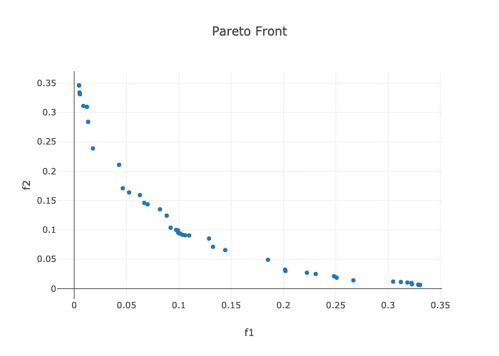

Solving High-Dimensional Multiobjective Optimization Problems
=============================================================

.. _high_d_ex:

Solving high-dimensional blackbox optimization problems is very hard.
Solving them in the multiobjective sense is even harder.
Doing this efficiently on a limited budget could be considered a
*grand challenge* type problem.

To quote our FAQ_:

 - The key issue is that **global optimization is expensive**.
   At a fundamental level, we cannot guarantee global convergence without
   densly sampling the design space, which is exponentially expensive
   when ``n`` (number of design variables) is large.
   So what can you do?
   You can switch to using **local modeling methods**, whose costs
   generally only grow linearly in the dimension.
   You will not get any global convergence guarantees, but in many
   cases, you will still be able to solve your problem.
 - If you have a lot of design variables, then you might do better
   with a local solver, by switching your surrogate to the
   :class:`LocalGaussRBF <surrogates.gaussian_proc.LocalGaussRBF>`
   surrogate.
   If you are using the
   :class:`LBFGSB <optimizers.lbfgsb.LBFGSB>` optimizer, then you
   will also need to switch to the
   :class:`TR_LBFGSB <optimizers.lbfgsb.TR_LBFGSB>` optimizer.

Going off a modification to the quickstart_, this will produce the
following script. We also have a similar example in the solver_farm_.

.. literalinclude:: ../../examples/local_method.py
    :language: python

The above code is able to *approximately* solve the problem on an
extremely limited budget given the large dimension, and it
produces the following figure of the Pareto points:

|

.. _FAQ: ../faqs.html
.. _solver_farm: https://github.com/parmoo/parmoo-solver-farm/tree/main/fayans-model-calibration-2022
.. _quickstart: ../quickstart.html
